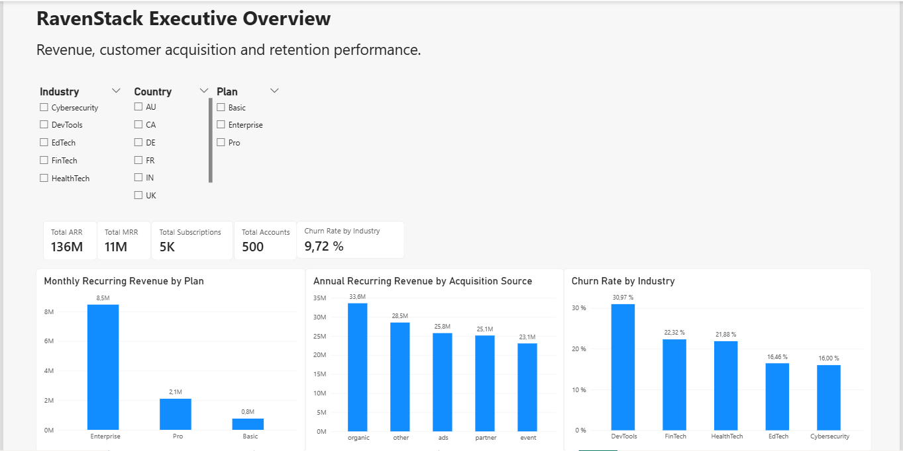
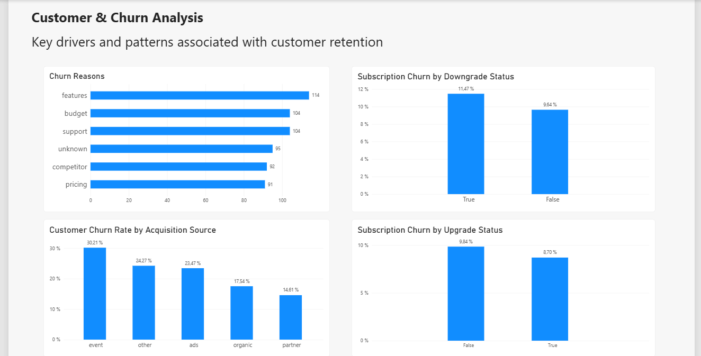
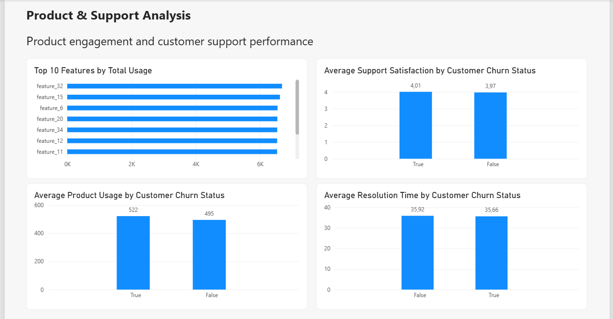

# RavenStack SaaS Business Analysis

## Project Overview

RavenStack is a synthetic SaaS business analysis project focused on understanding **revenue performance, customer acquisition, churn and retention, product engagement, and customer support**.

The project combines **SQL analysis** with an interactive **Power BI dashboard** to move from raw operational data to business findings and recommendations. The objective was not only to calculate metrics, but to investigate business questions, test hypotheses, identify retention risks, and communicate the results in a way that could support decision-making.

> **Note:** The dataset is synthetic. The project is intended to demonstrate analytical methodology, business reasoning, data visualization, and communication rather than make claims about a real company.

---

## Business Questions

The analysis was structured around several business areas:

### Customer Acquisition
- Which referral sources generate the strongest customers?
- Which industries generate the most value?
- Which countries generate the highest revenue?

### Revenue
- Which subscription plans generate the most recurring revenue?
- Do some plans experience higher churn than others?

### Product Usage
- Which product features receive the most usage?
- Is lower product usage associated with customer churn?
- How does beta-feature usage compare with non-beta features?

### Customer Support
- Is faster support associated with higher customer satisfaction?
- Do ticket priorities show different response, resolution, or escalation patterns?
- Which accounts generate the most support demand?

### Churn & Retention
- Why do customers leave?
- Does support experience differ between churned and retained customers?
- Are upgrades and downgrades associated with subscription churn?
- Why does the DevTools segment show particularly high churn?

---

## Tools & Skills

- **SQL** — exploratory analysis, joins, aggregations, subqueries, `CASE` statements, grouping, and business-metric calculations
- **Power BI** — data modeling, DAX measures, interactive dashboards, slicers, KPI cards, and business-focused visualizations
- **Power Query** — data preparation and type validation
- **Excel** — initial data review and quality checks
- **Business Analysis** — hypothesis testing, KPI definition, segmentation, interpretation, recommendations, and identification of data limitations

---

## Dataset

The analysis uses five related tables:

- `ravenstack_accounts` — customer/account characteristics
- `ravenstack_subscriptions` — subscription plans, revenue, churn, upgrades, and downgrades
- `ravenstack_feature_usage` — product-feature usage
- `ravenstack_support_tickets` — support response, resolution, satisfaction, priority, and escalation data
- `ravenstack_churn_events` — stated churn reasons

A key methodological consideration was **metric granularity**.

Customer characteristics such as industry and referral source were analyzed using **account-level churn**, while plan, upgrade, and downgrade analysis used **subscription-level churn**. Keeping these levels separate prevents misleading comparisons caused by using the wrong denominator.

---

## Analysis Process

The project followed an end-to-end analytical workflow:

1. Reviewed the dataset structure and data quality.
2. Defined business questions and initial hypotheses.
3. Used SQL to investigate acquisition, revenue, product usage, support, and churn.
4. Performed follow-up analysis when important patterns emerged.
5. Built a relational model in Power BI.
6. Created DAX measures for revenue, account/subscription counts, churn, and product usage.
7. Designed a three-page interactive dashboard.
8. Translated the results into business findings, recommendations, and limitations.

---

# Power BI Dashboard

The final dashboard contains three pages designed for different levels of analysis.

## 1. Executive Overview

The Executive Overview provides a high-level view of RavenStack's commercial and retention performance.

It includes:

- Total ARR
- Total MRR
- Total subscriptions
- Total accounts
- Subscription churn rate
- MRR by subscription plan
- ARR by acquisition source
- Customer churn by industry
- Industry, country, and plan filters

**Dashboard:**



---

## 2. Customer & Churn Analysis

This page focuses on customer retention patterns and potential warning signals.

It includes:

- Stated churn reasons
- Customer churn by acquisition source
- Subscription churn by downgrade status
- Subscription churn by upgrade status

**Dashboard:**



---

## 3. Product & Support Analysis

This page investigates whether product engagement or support performance helps explain customer churn.

It includes:

- Top features by total usage
- Average product usage by customer churn status
- Average support satisfaction by customer churn status
- Average resolution time by customer churn status

**Dashboard:**



---

# Key Findings

## 1. Enterprise dominates recurring revenue, but plan tier does not explain churn

Enterprise is RavenStack's most important subscription tier from a recurring-revenue perspective.

However, subscription churn rates are very similar across plans:

- **Enterprise:** 9.98%
- **Pro:** 9.67%
- **Basic:** 9.49%

This suggests that plan tier is not strongly associated with churn in this dataset.

---

## 2. Acquisition performance varies meaningfully by source

Organic generated the highest total ARR, while Partner showed the lowest customer churn rate.

Customer churn by acquisition source was:

- **Event:** 30.21%
- **Other:** 24.27%
- **Ads:** 23.47%
- **Organic:** 17.54%
- **Partner:** 14.61%

Event-acquired customers therefore stand out as a retention concern, while Organic and Partner appear stronger overall.

---

## 3. DevTools is the clearest industry-level retention risk

Customer churn by industry showed a substantial difference:

- **DevTools:** 30.97%
- **FinTech:** 22.32%
- **HealthTech:** 21.88%
- **EdTech:** 16.46%
- **Cybersecurity:** 16.00%

Because DevTools had the highest churn rate, additional SQL analysis was performed to investigate the segment.

However, the follow-up did **not identify a clear driver**:

- DevTools did not show clearly worse support performance.
- DevTools had relatively high product usage.
- Its churn reasons were distributed across support, budget, features, competitors, pricing, and unknown reasons.

The available variables therefore do not fully explain the segment's elevated churn.

---

## 4. Churn is multidimensional

No single stated churn reason dominates:

- **Features:** 19.00%
- **Support:** 17.33%
- **Budget:** 17.33%
- **Unknown:** 15.83%
- **Competitor:** 15.33%
- **Pricing:** 15.17%

Rather than pointing to one isolated problem, the results suggest that retention challenges span product, support, affordability, and competitive factors.

---

## 5. Lower product usage does not explain churn

The analysis tested the hypothesis that customers with lower engagement would be more likely to churn.

Instead, average accumulated product usage was approximately:

- **Churned accounts:** 522
- **Non-churned accounts:** 495

The hypothesis was therefore not supported.

This should not be interpreted as evidence that higher usage causes churn. Total accumulated usage can also be influenced by factors such as subscription count or observation period. The appropriate conclusion is simply that **the analysis did not find evidence that churned accounts had lower product usage**.

---

## 6. Aggregate support metrics do not clearly explain churn

Churned and retained customers showed very similar support outcomes.

Average satisfaction was approximately:

- **Churned:** 4.01
- **Non-churned:** 3.97

Average resolution time was approximately:

- **Churned:** 35.66 hours
- **Non-churned:** 35.92 hours

Churned customers also had a somewhat higher escalation rate (5.56% vs. 4.53%), but the difference was modest.

Overall, response speed, resolution time, and satisfaction do not provide a clear explanation for churn in the available data.

---

## 7. Subscription changes show modest retention signals

Downgraded subscriptions showed somewhat higher churn:

- **Downgraded:** 11.47%
- **Not downgraded:** 9.64%

Upgraded subscriptions showed somewhat lower churn:

- **Upgraded:** 8.70%
- **Not upgraded:** 9.84%

The differences are relatively small, so they should be treated as **associations rather than causal effects**. However, a downgrade may be useful as one potential retention-warning signal.

---

# Business Recommendations

Based on the analysis, RavenStack could consider the following actions:

### Investigate the DevTools segment
DevTools has the highest customer churn rate, but the available quantitative variables do not explain why. Additional research should focus on qualitative feedback, feature requirements, competitive alternatives, pricing sensitivity, onboarding, and customer expectations.

### Review the Event acquisition channel
Event-acquired customers show the highest customer churn rate. The business should examine targeting, lead quality, onboarding, and whether expectations established during acquisition align with the actual product experience.

### Use downgrades as a potential retention trigger
Because downgraded subscriptions show modestly higher churn, downgrade activity could be used as one signal for proactive retention outreach. The relationship should be validated with additional data before being treated as predictive.

### Avoid reducing churn to a single issue
Churn reasons are broadly distributed. A retention strategy focused exclusively on pricing, support, or product features would overlook other meaningful factors.

### Collect richer retention data
The DevTools investigation demonstrates an important limitation: existing metrics can identify **where** a problem exists without necessarily explaining **why**. Additional onboarding, tenure, pricing, cohort, product-behavior, competitor, and qualitative-feedback data would support deeper root-cause analysis.

---

# Limitations

- The dataset is **synthetic**, so findings should be interpreted as a demonstration of analytical methodology rather than real-world commercial evidence.
- The analysis identifies **associations, not causation**.
- Product features use generic names such as `feature_32`, which limits product-level interpretation.
- Total accumulated usage may be influenced by factors beyond engagement, such as subscription count or observation period.
- Aggregate support metrics may not capture qualitative support problems.
- Additional cohort, tenure, onboarding, pricing, and customer-feedback data would be needed for deeper churn analysis.

---

## Repository Structure

```text
ravenstack-saas-analysis/
│
├── README.md
├── ravenstack_analysis.sql
├── RavenStack_Dashboard.pbix
│
├── data/
│   └── Dataset files or source information
│
└── screenshots/
    ├── executive_overview.png
    ├── customer_churn_analysis.png
    └── product_support_analysis.png
```

---

## Project Takeaway

This project demonstrates an end-to-end business analysis workflow: defining business questions, analyzing relational data with SQL, building business metrics and an interactive Power BI dashboard, testing hypotheses, investigating unexpected findings, and translating the results into actionable recommendations.

One of the most important analytical lessons from the project was that useful analysis does not always produce a simple explanation. Several initial hypotheses were not supported, and the DevTools investigation did not reveal a definitive cause for its elevated churn. Rather than forcing a conclusion, the analysis identifies what the available data supports, what it does not support, and what additional information would be required for better decision-making.
